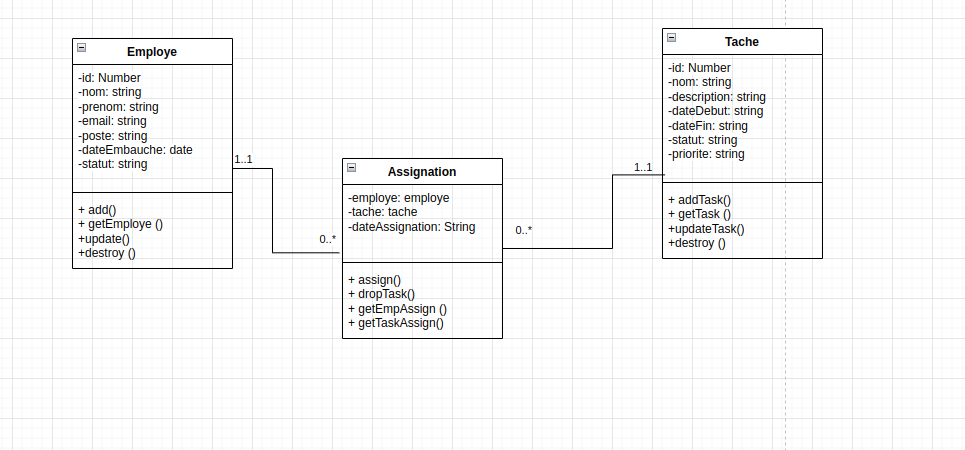

#UML



# Clonez le dépôt de l'application
```git clone https://github.com/Ehya-Ag/gestion-employe-express.git```

# Accédez au répertoire du dépôt
```cd gestion-employe-express```

# Installez les dépendances nécessaires
```npm install```

# Lancez l'application
```npm start```

